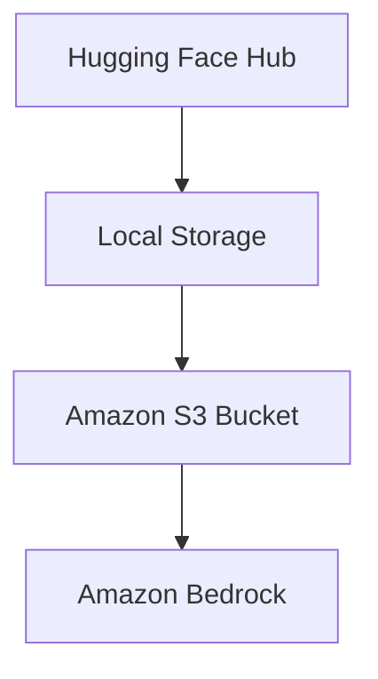

# 🤗 Hugging Face Bedrock Importer: Easily deploy HF Models to Amazon Bedrock 🚀

The Hugging Face Bedrock Importer is a command-line tool that simplifies the process of downloading Hugging Face models and deploying them to Amazon Bedrock. This tool automates the workflow of model download, Amazon S3 upload, and Bedrock Custom Model Import, making it easier for developers to leverage Hugging Face language models in their AWS environment.

📚 Hugging Face models overview: https://huggingface.co/models

With this importer, you can quickly bring powerful language models from Hugging Face into your Bedrock ecosystem. It handles the complexities of model download, S3 storage management, and Bedrock custom model creation, allowing you to focus on utilizing these models in your applications.

## Installation

To use the Hugging Face Bedrock Importer, ensure you have Python 3.11+ installed. Then, follow these steps:

#### Install with pip
```bash
pip install git+https://github.com/masquare/huggingface-bedrock-importer.git
```

#### Install with uv
```bash
uv tool install git+https://github.com/masquare/huggingface-bedrock-importer.git
```

## Usage

> [!NOTE]  
> Ensure your AWS credentials are properly set up, either through environment variables or the AWS CLI configuration (see [docs](https://boto3.amazonaws.com/v1/documentation/api/latest/guide/credentials.html)).
> Make sure Amazon Bedrock Custom Model Import is supported in the AWS Region you are planning to use. You can check region support [here](https://docs.aws.amazon.com/bedrock/latest/userguide/model-customization-import-model.html).

To import a Hugging Face model to Bedrock, use the following command:
```bash
hf-bedrock-import --model-id <model_id> --s3-uri <s3_uri>
```

Replace `<model_id>` with the Hugging Face model ID and `<s3_uri>` with the S3 URI where you want to store the model files (e.g., `s3://amzn-s3-demo-bucket/hf_models/`).

Example:
```bash
hf-bedrock-import --model-id deepseek-ai/DeepSeek-R1-Distill-Llama-8B --s3-uri s3://amzn-s3-demo-bucket/hf_models/
```

### Configuration Options

The importer supports the following command-line options:

- `--model-id`: Hugging Face model ID (default: "deepseek-ai/DeepSeek-R1-Distill-Llama-8B")
- `--s3-uri`: S3 URI for model storage
- `--cleanup-resources`: Cleanup AWS resources (Bedrock custom model, IAM role, S3 model files)
- `--cleanup-model`: Cleanup local model files
- `--test`: Test the model after importing it

### Common Use Cases

1. Import a model and test it:
   ```bash
   hf-bedrock-import --model-id deepseek-ai/DeepSeek-R1-Distill-Llama-8B --s3-uri s3://amzn-s3-demo-bucket/models/
   ```

   The script will print the model ARN that you can use to invoke the model, as well as a link to the Bedrock Playground where you can play around with the model:
   ```
   Model ARN: arn:aws:bedrock:{AWS_REGION}:{ACCOUNT_ID}:imported-model/{MODEL_ID}

   Link to the Bedrock playground for the model: https://{AWS_REGION}}.console.aws.amazon.com/bedrock/home#/text-generation-playground?mode=text&modelId=arn%3Aaws%3Abedrock%3A{AWS_REGION}%3A{ACCOUNT_ID}%3Aimported-model%2F{MODEL_ID}
   ```

   Note: Using custom models in Amazon Bedrock incurs costs. See the [Amazon Bedrock pricing page](https://aws.amazon.com/bedrock/pricing/) for more details.


2. Clean up AWS resources for a specific model:
   ```bash
   hf-bedrock-import --model-id deepseek-ai/DeepSeek-R1-Distill-Llama-8B --s3-uri s3://amzn-s3-demo-bucket/models/ --cleanup-resources
   ```

3. Clean up local model files:
   ```bash
   hf-bedrock-import --model-id bert-base-uncased --cleanup-model
   ```

## Code Usage

Integrate the Hugging Face Bedrock Importer in your own code. Example:

```python
from huggingface_bedrock_importer import importer

S3_URI = "s3://amzn-s3-demo-bucket/hf-models/"
MODEL_ID = "deepseek-ai/DeepSeek-R1-Distill-Llama-8B"

# import model to Bedrock
model_arn = importer.import_model_to_bedrock(MODEL_ID, S3_URI)

# use the model
bedrock_runtime = boto3.client("bedrock-runtime"))
prompt = "What is the capital of France?"
invoke_response = bedrock_runtime.invoke_model(
    modelId=model_arn, body=json.dumps({"prompt": prompt})
)
invoke_response["body"] = json.loads(invoke_response["body"].read().decode("utf-8"))
print(json.dumps(invoke_response, indent=4))


# cleanup
importer.cleanup_aws_resources(S3_URI, MODEL_ID)
importer.cleanup_local_resources(MODEL_ID)
```

### Troubleshooting

1. S3 Access Issues:
   - Problem: "Access Denied" errors when uploading to S3
   - Solution: Ensure your AWS credentials have the necessary permissions to write to the specified S3 bucket
   - Diagnostic steps:
     1. Check your AWS credentials configuration
     2. Verify IAM user/role permissions for S3 access
     3. Try uploading a test file to the S3 bucket using the AWS CLI

2. Model Download Failures:
   - Problem: Unable to download the model from Hugging Face
   - Solution: Verify internet connection and Hugging Face API status
   - Diagnostic steps:
     1. Check your internet connection
     2. Ensure the model ID is correct and publicly accessible
     3. Try downloading the model manually from the Hugging Face website

3. Bedrock Import Errors:
   - Problem: Model import to Bedrock fails
   - Solution: Check IAM role permissions and S3 bucket accessibility
   - Diagnostic steps:
     1. Verify the IAM role has the correct permissions for Bedrock and S3
     2. Ensure the S3 bucket is in the same region as your Bedrock endpoint
     3. Check Bedrock service quotas to ensure you haven't exceeded limits

## Data Flow

The Hugging Face Bedrock Importer follows this data flow when importing a model:

1. Download model from Hugging Face Hub to local storage
2. Upload model files from local storage to specified S3 bucket
3. Create or retrieve IAM role for Bedrock model import
4. Initiate Bedrock model import job using S3 location and IAM role
5. Wait for import job completion and retrieve model ARN
6. (Optional) Test the imported model with a sample prompt



Note: Ensure sufficient storage capacity in local environment, as language models can be several gigabytes in size.
